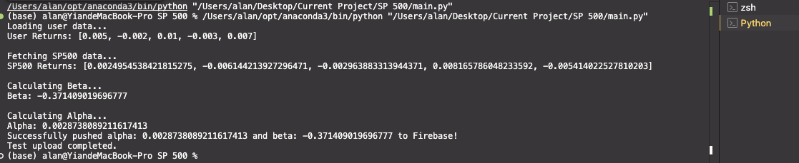

# Alpha and Beta Calculation Project

## Overview

This project calculates the **alpha** and **beta** values based on user performance data compared to the S&P 500 performance for a given week. The results are uploaded to Firebase using a cron job for automation.

### Example Output

1. **Firebase Database Screenshot**:
   

2. **Alpha and Beta Calculation Result**:
   

---

## File Descriptions

1. **`.gitignore`**

   - Specifies files and directories to ignore in version control (e.g., sensitive credentials or temporary files).

2. **`alpha_beta.py`**

   - Core script for calculating the **alpha** and **beta** values.
   - Imports user performance and S&P 500 data and computes statistical values.

3. **`cron_log.txt`**

   - Log file for tracking cron job executions and potential errors.

4. **`data_fetch.py`**

   - Contains functions for fetching S&P 500 performance data via an API.
   - Fetches historical data for a given week.

5. **`main.py`**

   - The entry point for the application.
   - Combines all functionalities: fetches data, computes alpha and beta, and pushes results to Firebase.

6. **`requirements.txt`**

   - Lists Python dependencies needed for the project.
   - Use this file to install necessary libraries.

7. **`user_data.json`**
   - Stores user performance data (e.g., daily percentage changes for a given week).
   - Modify this file to customize user input data.

---

## How to Use

### 1. Clone the Repository

First, clone the GitHub repository to your local machine:

```bash
git clone https://github.com/AlanY1an/AlphabetafromSP500.git
cd AlphabetafromSP500
```

### 2. Install Dependencies

Use the following command to install all required libraries:

```bash
pip install -r requirements.txt
```

### 3. Customize User Data

Modify the `user_data.json` file to input your own daily performance data. For example:

```json
{
  "Day 1": 0.5,
  "Day 2": -0.2,
  "Day 3": 1.0,
  "Day 4": -0.3,
  "Day 5": 0.7
}
```

These values represent your daily percentage change in performance for the week.

### 4. Firebase Setup

To upload results to Firebase:

1. Go to the [Firebase Console](https://console.firebase.google.com/).
2. Create a Firebase project (if you don’t have one).
3. Generate a service account key:
   - Navigate to **Project Settings > Service Accounts**.
   - Click "Generate New Private Key" and download the JSON file.
4. Save the file as `firebase-service-account.json` in the project root directory.

### 5. Run the Script

Run the main script to calculate alpha and beta and upload the results:

```bash
python main.py
```

---

## Automating with Cron Job

To automate the process and run the script every Friday at **4:30 PM EST**:

1. Open your cron table:

   ```bash
   crontab -e
   ```

2. Add the following entry:

   ```bash
   30 16 * * 5 /usr/bin/python3 /path/to/main.py >> /path/to/cron_log.txt 2>&1
   ```

   - `30 16 * * 5`: Runs every Friday at 4:30 PM (EST).
   - `/usr/bin/python3`: Path to your Python 3 interpreter.
   - `/path/to/main.py`: Replace with the full path to the `main.py` script.
   - Logs output and errors to `cron_log.txt`.

3. Save and exit. Verify your cron job:
   ```bash
   crontab -l
   ```
